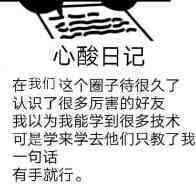

# 欢迎路过
来都来了，不去[我的主页](https://github.com/PhilSongZi)看看嘛。

## 个人练习项目
抄了些github的开源项目拿来练习，挖坑不忘填坑才是合格的挖坑人。希望自己记得fork的项目确实是练习了的。**收藏**=**学会**了，醒醒，别做梦了！

## 捣鼓的一些其他玩意
干啥啥不行，干饭第一名。课题难死人，摸鱼爽得很。

### 微信公众号
闲来无事，写点小玩意儿给自己看。[你确定要看？](https://mp.weixin.qq.com/s/Eag53muocKlOtmRS72iHhQ)

### 读书笔记
好读书，不求甚解。  

### 练琴实录
“**有手就行。**”——我手呢？  
  
  

## 缘来是你
丘丘：1744785343.
